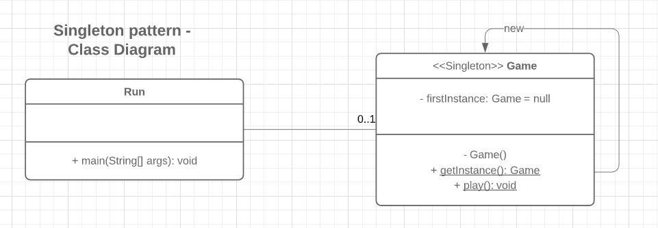
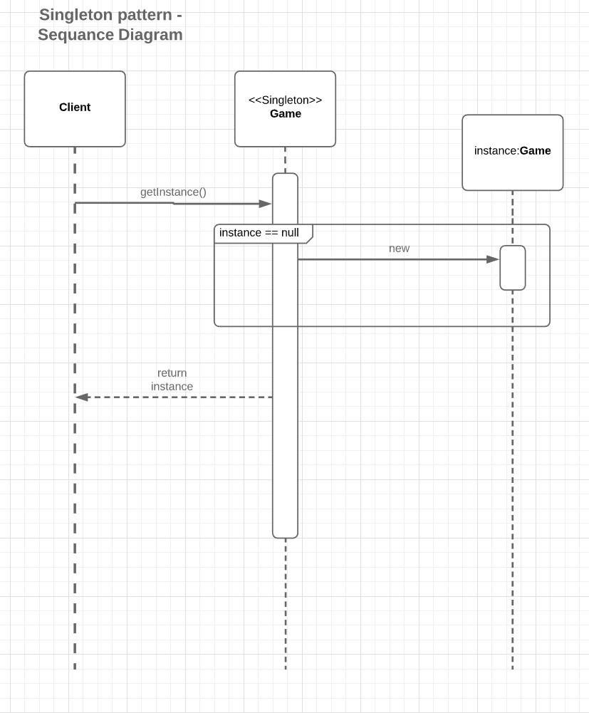

## Part 1 

a) Singleton

1) We used the singleton pattern to ensure the Game class has only one instance. Because we don't want the user to
   be able to create multiple games at the same time. 
   This goal is achieved by: 

   - creating a firstInstance variable of type Game in Game class which is set to null.
 
   - making Game constructor private (was already the case, so no changes made!)
 
   - creating static getInstance() method in Game class which checks if there is already an instance of Game.
    If not, it initializes a new instance of Game and returns it. Otherwise, it returns the existing instance. 
 
   - creating a new Java class called "Run" and moving the main method from Game class to Run class. So that the main
    function has no more access to the private Game constructor. Therefore, we had to adjust the play method to 
    public so that the main function of the Run class can start the Game. 
 
2) 
3) 
          

b) Iterator

## Part 2

## Part 3

- The notation accepted as input stays the same as in Assignment 2 (i.e. moves should follow the algebraic notation, where
captures are denoted with a 'x')

#### Implementation choices
- There is an Observer Interface which is implemented by the Scoreboard class.
- There is a Subject Interface which is implemented by the Score class.
- I decided to create the Score class instead of implementing the Subject in the Game class in order to
keep the design pattern comprehensible.
- The Game class calls the design pattern by calling the *notifyObservers* method.

#### Class diagram for the Observer design pattern

