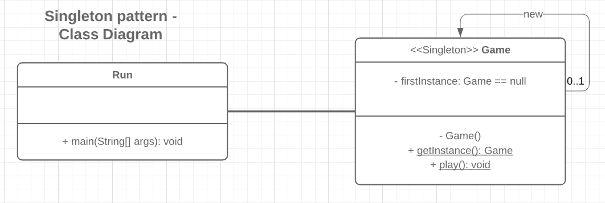
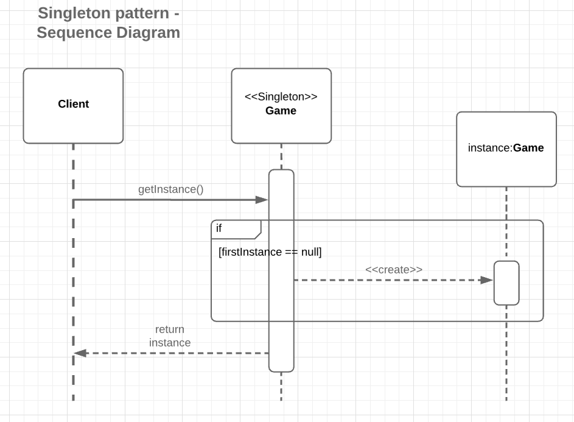
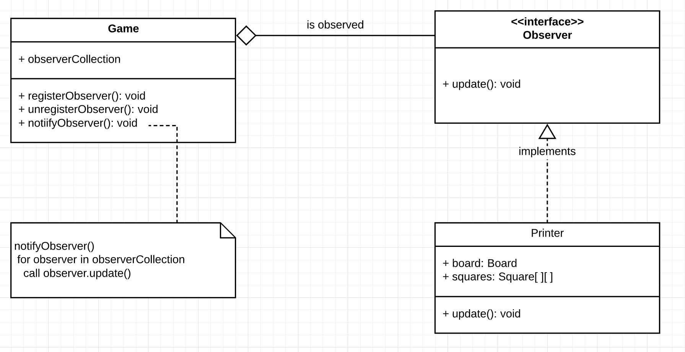
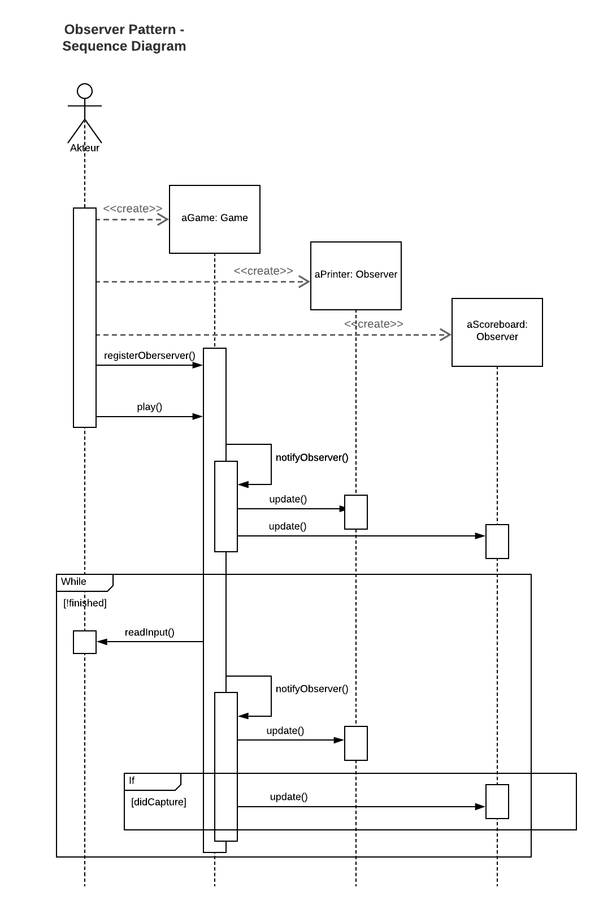
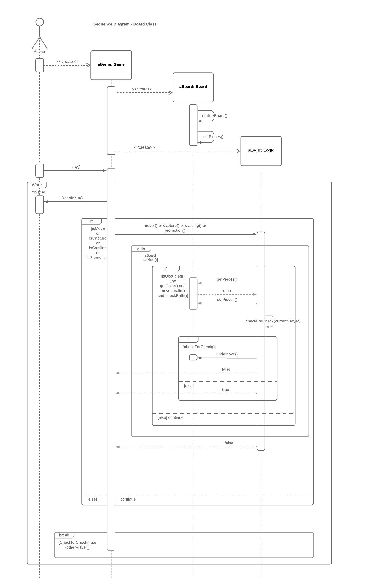
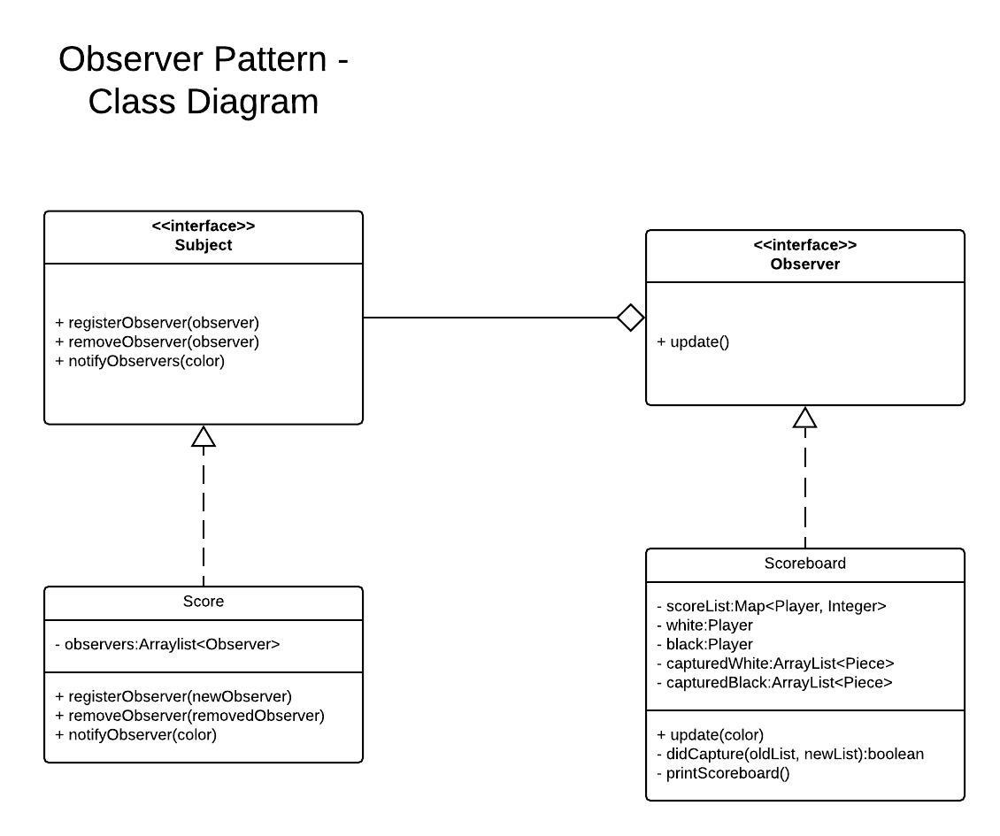

## Part 1: 
this is based on code of assignment 2

a) Singleton

1) We used the singleton pattern to ensure the Game class has only one instance. Because we don't want the user to
   be able to create multiple games at the same time. 
   This goal is achieved by: 
   - creating a firstInstance variable of type Game in Game class which is set to null.
   - making Game constructor private (was already the case, so no changes made!)
   - created static getInstance() method in Game class which checks if there is already an instance of Game.
    if not, it initializes a new instance of Game and returns it. Otherwise, it return the existing instance. 
   - creating a new Java class called "Run" and moved the main method from Game class to Run class. So that the main
    function has no more access to the private Game constructor. Therefore, we had to adjust the play method to 
    public so that the main function of the Run class can start the Game. 
 
2) 
3) 

          

b) Observer

1) We used the observer pattern to obtain that when the Game (Subject) state is changed the Printer (Observer) is
    notified and updated automatically. At this moment, there is only one observer, other observers (e.g. a scoreboard) can be added easily in future.
    This goal is achieved by:
    - created an interface, called Observer, with one method: update()
    - created a class printer which implements observer and overwrites update() to print the board
    - created an ArrayList called observerCollection in Game which keeps track of the observers, new observers can be added by registerObserver() and
        observers can be removed by unregisterObserver(). Further, the method notifyObserver() calls the methods update() for 
        every observer in the ArrayList observerCollection
    - in main() in Run class the obj (aPrinter) of type Printer is created and the method registerObserver(aPrinter) is called
    - we choose to not make an interface for the Subject because Game is the only Subject that has to notify in this case
        
2) 

3) 

## Part 2:
This sequence diagram is based on the code of assignment 2. For the sake of clarity, we choose to make following simplifications:
 - only the actor, Game class, Board class and Logic class are present in this sequence diagram.
    Surely, other classes like Piece are involved in the process. However, to understanding which methods can transition the board to different state,
     they are not necessary (e.g. it does not matter for the board if the set piece is a pawn or a king...) 
 - the only methods which can directly make the board transition to a different state are initializeBoard() and setMove(). (undoMove() also uses setMove()) 
    but also when aBoard is created by the constructor of Game class 
 - ReadInput() normally would check if input is valid and provide appropriate feedback, we simplified this and assume the input is valid 
 - We left away unnecessary things (for understanding board and it's transitions)
    like printing the board, converting input into integers, update lastMove and so on 

## Part 3

- The notation accepted as input stays the same as in Assignment 2 (i.e. moves should follow the algebraic notation, where
captures are denoted with a 'x')

#### Implementation choices
- There is an Observer Interface which is implemented by the Scoreboard class.
- There is a Subject Interface which is implemented by the Score class.
- I decided to create the Score class instead of implementing the Subject in the Game class in order to
keep the design pattern comprehensible.
- The Game class calls the design pattern by calling the *notifyObservers* method.

#### Class diagram for the Observer design pattern

