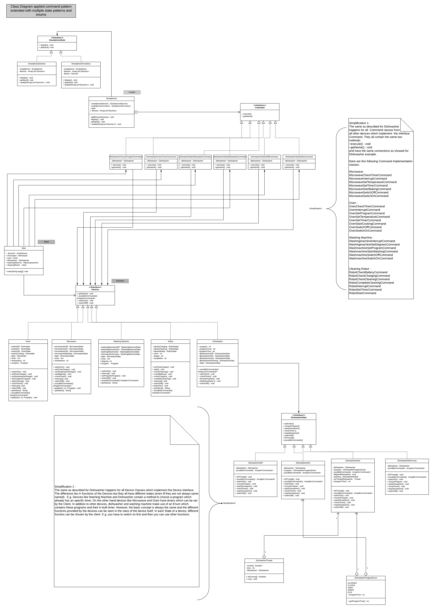

We chose following simplifications:
1) since the command implementation classes for every device and every command are quite similar and since there
    are a lot of Command classes which implement the command interface, we chose to only show the Command
    classes and logic for the device dishwasher. However, it is stated clear in the diagram which and where 
    Command classes would go for all other devices.
2) since the state interfaces and their implementation classes are quite similar for every device, 
    we again chose to only show the implementations and logic of the device dishwasher. However, it is clearly stated
    in the diagram where state interfaces and their implementation classes should go for other devices. 
3) We chose the dishwasher as example because it additionally contains an enum.

4) Class Diagram 

