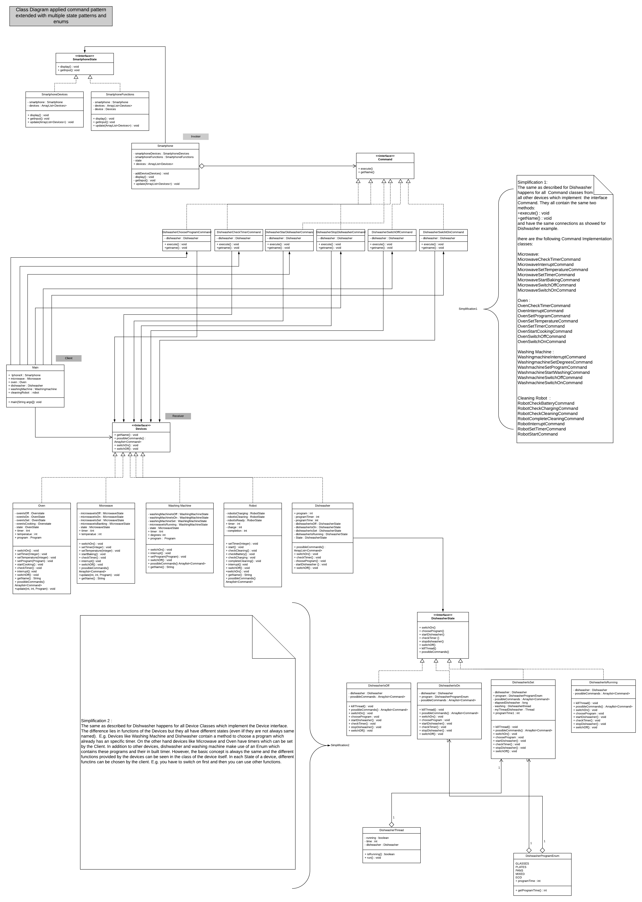

We made following design choices:
   - We have a class Smartphone which serves as Invoker
   - We have a Command interface with two public methods: execute() and getName()
   - this Command interface is implemented by several concrete Commands
   - Main class serves as Client
   - We have an Interface Devices which serves as Receiver   
   - 5 different Devices implement this Interface Devices
   - Additionally, we applied the state pattern. Every device has different states like DishwasherIsOn, DishwasherIsOff and so on. 
        in these States all methods from the DishwasherState are overwritten, such that only functions that make sense in this state
        can be executed by the client. The client only has the choice between functions that make sense in this state and since wrong
        input is caught, the client can not execute other functions. However, even if the client could execute this functions, then 
        feedback is provided in the console and the function does no further action. 
   - Further we added a SmartphoneState Interface which contains functions to get input or to display the menu in the console. 
        It depends on the state of the Smartphone, (e.g. where the user is in the menu) how the menu should be displayed. Therefore
        we applied this second state pattern. 
        
Some rules:
   - We followed the rules of the assignment sheet. 
   - the Robot is always on and can therefore not be turned off
   - in the menu the user always gives input by typing an integer
   - in some special functions like set timer the user can type in the number of seconds he want.
  
    
The class Diagram:
We chose following simplifications:
1) since the command implementation classes for every device and every command are quite similar and since there
    are a lot of Command classes which implement the command interface, we chose to only show the Command
    classes and logic for the device dishwasher. However, it is stated clear in the diagram which and where 
    Command classes would go for all other devices.
2) since the state interfaces and their implementation classes are quite similar for every device, 
    we again chose to only show the implementations and logic of the device dishwasher. However, it is clearly stated
    in the diagram where state interfaces and their implementation classes should go for other devices. 
3) We chose the dishwasher as example because it additionally contains an enum.

4) Class Diagram     
    
        
        
    
