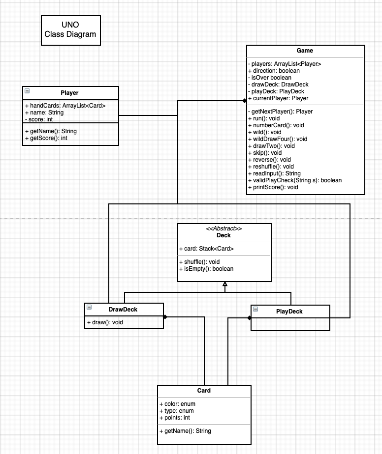

## Part 1: 
This assignment is based on the code of assignment 1 from 09.10.2019

We created 26 tests with each containing many assertions and the following 9 tests failed: 

1.1) In PlayerTest.java: createNullPlayer()
- This test failed because we did not check in the Player constructor if the player is null
- we discovered this while checking corner cases in the Player constructor in the above described test
- we fixed this bug by inserting an if statement which checks if a player is null in the Player
constructor and if so, throwing an IllegalArgumentException with the message "cannot create null player"

1.2) In PlayerTest.java: createEmptyNamePlayer()
- This test failed because we did not check in the Player constructor if the player name is an empty string
- we discovered this while checking corner cases in the Player constructor in the above described test
- we fixed this bug by inserting an if statement which checks if a players name is an empty string in the Player
constructor and if so, throwing an illegalArgumentException with the message "cannot create empty name player"
     
1.3) In PlayerTest.java: createPlayerPositionSmallerThanZero()
- This test failed because we did not check in the Player constructor if the player position is smaller than zero
- we discovered this while checking corner cases in the Player constructor in the above described test
- we fixed this bug by inserting an if statement which checks if a players position is smaller than zero in the Player
constructor and if so, throwing an illegalArgumentException with the message "cannot create player at position smaller than zero"

1.4) In GameTest.java: gameConstructorNullPlayerInput() and gameConstructorNullPlayerInput1()
- This tests failed because we did not check in the Game constructor if a Player name is null
- we discovered this while checking corner cases in the Game constructor in the above described tests
- we fixed this bug by inserting an if statement which checks if a Player name is null that is passed to the Game
constructor and if so, throwing an illegalArgumentException with the message "cannot create game with null player"

1.5) In GameTest.java: gameConstructorEmptyStringInput() and gameConstructorEmptyStringInput1()
- This tests failed because we did not check in the Game constructor if a Player name is empty String
- we discovered this while checking corner cases in the Game constructor in the above described tests
    we don't want to allow empty names since with an empty name you can not see on the printed game state in the console
    where the players is at the moment and when a game is finished, you can not see who has won. Therefore, we want to provide
    the user to make the mistake and typing in an empty name
- we fixed this bug by inserting an if statement which checks if a Player name is empty String that is passed to the Game
constructor and if so, throwing an illegalArgumentException with the message "cannot create game with no name players"

1.6) In GameTest.java: gameConstructorBoardSizeSmallerThan2() and gameConstructorBoardSizeSmallerThan2_1
- This tests failed because we did not check in the Game constructor if the boardsize is an int smaller than two
- we discovered this while checking corner cases in the Game constructor in the above described tests
    a boardsize <= 1 makes obviously no sense. Therefore, we do not allow this. Also, a boardsize of two does not really make sense but here we want
    to let the user decide if this makes sense for him/her.
- we fixed this bug by inserting an if statement which checks if the boardsize is smaller than two that is passed to the Game
constructor and if so, throwing an illegalArgumentException with the message "cannot create game with boardsize < 2"

after testing and fixing the bugs, every test passes and the game works fine.
Note that we had to create some getters and setters in order to access private attributes in tests.
In addition to all above described test we let the game run and noticed that when you pass in an empty
name string for player1 name, then the program asks for the name of the second player even if after getting
input the program will terminate due to built in exception throwings.
To fix that and make the program more user friendly, we additionally inserted if statements in the main method which check for empty string names/ null names and 
boardsizes smaller than two and if so throw an exception, like we also did in the player and game constructor. Therefore, it is obvious that
the Game constructor and the Player constructor will never receive empty string player name inputs or invalid boardsizes like the logic of our game program is now. 
This makes the invalid input checking in the Game and Player constructor seem kind of unnecessary, but in fact it isn't since
we want every part of our program to work on its own and to  work independent of the implementation of other prorgam parts and 
therefore be encapsulated. Like this, further adaptions and extensions can easily be done. 

## Part 2:

2.1) All changes were made in GameBoard.java: 
In the GameBoardTest.java following tests failed:

- markTwice: This test failed because the mark(int row, int col, TicTacToeGameState.Player player) method of class GameBoard returned wrong boolean values (they were switched).
Following changes were performed in order to correct the code and let the test pass:
    
    - the return statement had to be changed from TRUE to FALSE, 
    if the board square was already occupied 
    
    - the return statement had to be changed from FALSE to TRUE,
    if the board square was not already occupied.
    
- getOpenPositions: This test failed because the column started iterating at index 1 instead of index 0 in the getOpenPositions()
method of the GameBoard class.
Following changes were performed in order to correct the code and let the test pass:

    - the index where the column starts to iterate had to be changed to 0.
    
- getOpenPositionsAll: This test failed for the same reason as the test above "getOpenPositions" failed and 
hence same changes were performed. 

- markOnBoard: This test failed because in the javaDoc description of the GameBoard constructor the @param "the board to copy" was not named right.
Following changes were performed in order to correct the code and let the test pass:

    - In the JavaDoc of the GameBoard constructor, the @param parameter had to be changed from BOARD to OTHER

2.2) All changes were made in TicTacToeGameState.java:
In the TicTacToeGameStateTest.java following tests failed:

- startingPlayerIsX, getAvailableStatesLastOne and switchPlayer: these tests failed because the getCurrentPlayer() method from
the TicTacToeGameState class returned a random player instead of the current player.
Following changes were performed in order to correct the code and let the tests pass:
                                                                                         
    - we deleted the short code which generated a random player in the getCurrentPlayer() method.
    Like this the current player is returned.
    
- IsOverWin, hasWinCol, and hasWinTow: these tests failed because the hasWin(Player player) method returned false if the player had a complete row or if
the player had a complete column. What obviously makes no sense.
Following changes were performed in order to correct the code and let the tests pass:

    - In the hasWin(Player player) method, we have changed the return value from FALSE to TRUE if the player had a complete row
    or a complete column.

- hasWinDiagonal: this test failed because of an index mistake in the completesDiagonal(Player player) method. Instead of looking 
at the diagonal from the top-left to the bottom-right, it considered the middle-right square.
Following changes were performed in order to correct the code and let the tests pass:
    
    - In the completesDiagonal(Player player) method we changed the index from board.getMark(1, 2) to board.getMark(2, 2).
    
## Part 3

### 3.1 Behaviour of the UNO system

#### 1. Accepted (and non-accepted) Inputs

* At the beginning of the game, one user should input an integer in order to determine the number of players. The minimum
of this integer is 2 and the maximum is 10, according to the UNO rules.

* Second, the user can input the player's names one by one. These inputs should be of type String. Also, overly long names
and the empty string should not be accepted. For practical reasons, two players should not have the same name.

* During the game, at each turn, the user has 3 Options:
  * The user inputs the name of the card he/she has in his/her hands and he/she wants to play. There should be clear inputs for
  every single card ('Blue 5', 'Green 9', 'Red Skip', 'Yellow Draw 2' etc.).  
  Since after playing a 'Wild' card, the player can choose a color, he/she should input the desired color after the 'Wild' card,
  i.e. 'Wild Red' or 'Wild Draw 4 Red'.
  * The user does not want to or can not play a card and thus has to draw one from the draw stack. In this case the input should
  be 'Draw'.
  * The user wants to announce 'UNO'. For practical reasons, he/she should announce 'UNO' before he/she plays his/her second-to last
  card. The input when announcing 'UNO' should thus be 'UNO red 5'.

* If one player forgot to announce 'UNO', any other player in this round can, at his turn, 'claim UNO'. This should be done
before specifying the move of the player, i.e. 'claim UNO red 5'.

* Of course, if the input given by a user is not recognizable by the application since it does not follow the above explained
rules, the player can keep trying until he/she enters a valid input.

* The same should happen if the input is recognizable/valid, but the move the player wants to make is not valid.

***

#### 2. What should (and should not) happen with the input

* At the beginning of the game, after the user has input the number of players and their names, the application should
create the player objects accordingly.

* At each turn, the application should do the following with the input:
  * First, the application should parse the input in order to determine whether the input was valid.
  * Second, if the first condition holds, the application should check whether the move that the player wants to make is
  valid. This means that it should check whether the player indeed holds the card he wants to play, and if so, whether it can be played
  on top of the card which is currently on the top of the played cards stack. 
  * In case of a 'claim UNO', the validity of this should of course be checked too.

* If the validly played card is a number card, nothing other than the card being pushed onto the played cards deck
happens and it's the next player's turn.

* If a 'Wild Draw 4' or a 'Draw 2' card is validly played, the following things should happen:
  * The application should automatically add the respective amount of cards to the hand of the next player in the list.
  * The turn of the next player will be skipped.
  
* If a 'Skip' card is validly played, the application should automatically skip the next player in the list.
  
* If a 'Reverse' card is validly played, the application should change the direction of the game.

* Also, at each turn, the application should check whether the current player only holds two cards in his hands.  
That way, the application can handle a possible 'UNO' input or a future 'claim UNO' input correctly.

* If any draw command is validly entered and if at any point in the execution the draw stack gets empty, the application
 should automatically take the played cards stack (except for the card on top), shuffle it, and then use it as the draw stack.

***

#### 3. Expected outputs 

* At the beginning of the game, the application should ask for the number of players and their names.

* Then, after initializing the game, the application should notify the players that the game has started.

* At every turn, the application should output the following information:
   * The cards the current player has in his/her hands in order for him/her to know which options he/she has.
   * The card that is currently on top of the played cards deck.
   * The number of cards all the other players have left in their hand.

* If an input is not recognized by the application, it should inform the user and ask for a retry.

* The same happens if a move is not valid.

* When announcing 'UNO', the application shout output whether this announcement was valid. This should make the game more manageable
for the users (i.e. easier to remember if a player could 'claim UNO' at the moment).
 
* After a player has validly played the last card in his hand, the application shout output the winner of the round.

* Of course, during a round, the application should never output the following: 
  * The specific cards of any other than the current player
  * The color and value or action of any card that is in the draw deck
  
* After one round is finished, the application should output the following:
  * The number of points each player has made in this round
  * The total amount of points each player has made in each round so far
  
***

### 3.2) Class Diagram

  